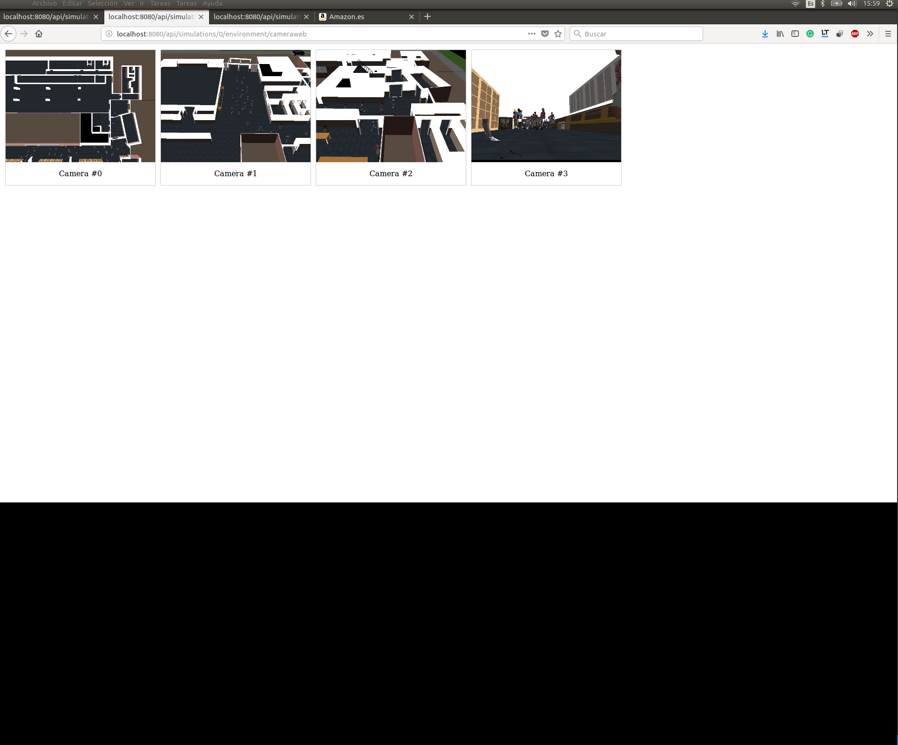

# API Web Services

## Introduction

The system allows getting information using web services to remote consult and manipulate the simulations. For instance, whether you can get the position of an agent with an HTTP query like this:

```
get http://[server]:[port]/api/simulations/[simID]/human-agent/allHumanInfo/
```

Where *server* and *port* are the IP of the machine and the port where MASSIS is running. 

*SimID* is the ID of the simulation. MASSIS can handler several simulations at the same time. Each simulation has an ID that identifies it. Consequently, when consulting something about a simulation using the Web API, you must specify the simulation ID which you refer.


## Some examples of Web API

If you running a simulation, stop it using control+c.

Run the example EntranceToClassDifferentWaves:

```bash
> ./LaunchServer.sh -f EntranceToClassDifferentWaves.lua
```

You mast remember where is the port where the MASSIS was configured. 


### Consulting all info about the agent

First, you can consult all information about the agents with the following command:


```bash
curl http://localhost:8080/api/simulations/0/human-agent/allHumanInfo/
```


*server*, *port* and the *simulation id* (in the example 0) may be different depending on the one established in your local configuration.

Note: You can use your favorite web browser to get the consults.

### Get postion of the agent

Next, you can consult the position of the agents with this commando:

```bash
curl http://localhost:8080/api/simulations/0/human-agent/positions/
```


### Consulting the physical rooms

The server provides the room configuration throw the Web API. That is useful when the user must want to draw the rooms in its custom application. 

```bash
curl http://localhost:8080/api/simulations/0/environment/rooms/
```


### Consulting the behavior of the agents

You can know the name of the behavior used in each agent with the following command.

```bash
curl http://localhost:8080/api/simulations/0/human-agent/behaviors/
```

You can consult the behavior of a particular angente, adding the id of the agent at the previous command.


```bash
curl http://localhost:8080/api/simulations/0/human-agent/behaviors/[entityID]
```


### Get streaming video of the simulation

The server allows visualizing the simulation using a web API. If you type the following example in your favourite web browser, it must show something similar that showed in the following image.

```
http://localhost:8080/api/simulations/0/environment/camera/0/video
```


### Creating a example with multiple web cameras

There is a scenario example that using multiple web cameras. Open the scenario MultipleWebCamera.lua. 

```LUA
Scenario = {
    Scene="Faculty_1floor",
    CameraConfig = {{
                        location = { 33.0, 50.0, 54.0 },
                        rotation = { 90.0, 0.0, 0.0 },
                        lookAt = { 0.0, 0.0, 0.0 }
                    }, {
                        location = {90.75225, 26.890236, 25.397486},
                        rotation = {41.377083,0.5595291,1.6008256E-7},
                        lookAt = {90.75225,26.890236,25.397486}
                    },
                    {
                        location = {23.008701, 17.934904, 26.059069},
                        rotation = {33.3199,0.44762328,2.6680428E-7},
                        lookAt = {23.008701,17.934904,26.059069}
                    },
                    {
                        location = {48.18943, 7.921671, 39.804356},
                        rotation = {-8.420923,84.17573,-3.841981E-6},
                        lookAt = {48.18943,7.921671,39.804356}
                    }}

,
    AgentsDescriptions = {
        Class1 = {
            behavior = "FollowingPath",
            SpeedMin = 1.0,
            SpeedMax = 5.0,
            AnimationSpeedReference = 4.0,
            RewriteParameter = {
                Path = "Class1"
            }
        },
        Class2 = {
            behavior = "FollowingPath",
            SpeedMin = 1.0,
            SpeedMax = 5.0,
            AnimationSpeedReference = 4.0,
            RewriteParameter = {
                Path = "Class2"
            }
        },
        Class3 = {
            behavior = "FollowingPath",
            SpeedMin = 1.0,
            SpeedMax = 5.0,
            AnimationSpeedReference = 4.0,
            RewriteParameter = {
                Path = "Class3"
            }
        },
        Class4 = {
            behavior = "FollowingPath",
            SpeedMin = 1.0,
            SpeedMax = 5.0,
            AnimationSpeedReference = 4.0,
            RewriteParameter = {
                Path = "Class4"
            }
        },
        Class5 = {
            behavior = "FollowingPath",
            SpeedMin = 1.0,
            SpeedMax = 5.0,
            AnimationSpeedReference = 4.0,
            RewriteParameter = {
                Path = "Class5"
            }
        }
    }
}

Commands:

MassisLua.createHuman("Class1", 25, "MainGate")
MassisLua.createHuman("Class1", 25, "BackGate")
MassisLua.createHuman("Class2", 20, "MainGate")
MassisLua.createHuman("Class2", 20, "BackGate")
MassisLua.createHuman("Class3", 15, "MainGate")
MassisLua.createHuman("Class3", 20, "BackGate")
MassisLua.createHuman("Class4", 25, "MainGate")
MassisLua.createHuman("Class4", 20, "BackGate")
MassisLua.createHuman("Class5", 25, "MainGate")
MassisLua.createHuman("Class5", 15, "BackGate")

```

In the section *CameraConfig* there are a set of four cameras configured. The first camera is the main camera used in the local render by default. The rest of the cameras are available on the web API using the following command:

```
http://localhost:8080/api/simulations/0/environment/cameraweb
```

To test the example, shutdown the current simulation (Control+c) and launch the following command:

```bash
> ./LaunchServer.sh -f MultipleWebCamera.lua
```

Next, yo consult the cameras with the following commando in your web browser:

```
http://localhost:8080/api/simulations/0/environment/cameraweb
```

The result must be something like this image shown below:




