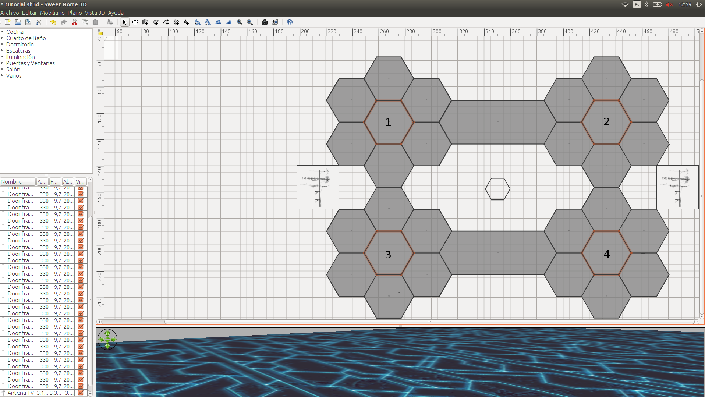
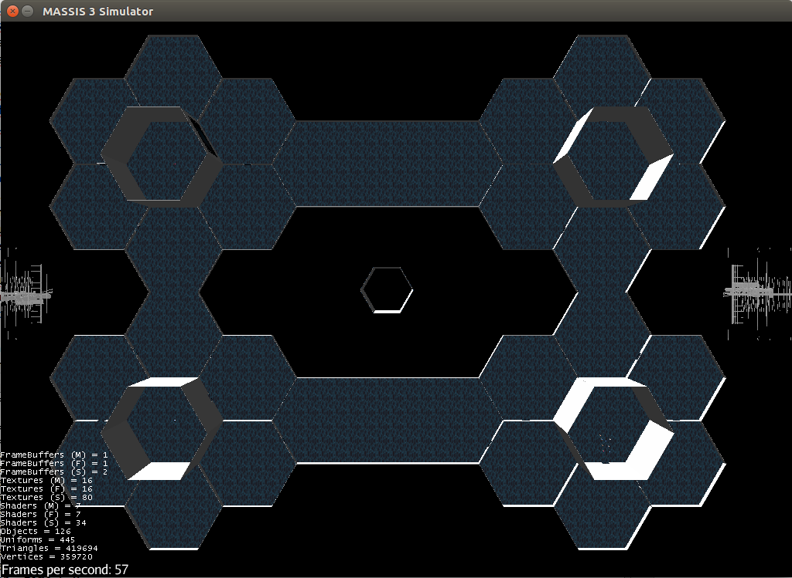

# Creating new environments

## Introduction

The system allows adding new environments to be used in the simulations. In this section of the tutorial, we are going to add a space station as a new scenario and we try to rescue the crew of the station.

## Adding the scene model

To add a new scene we using Sweet Home 3D to create the scene model. In this tutorial we provide the scene already created in the Sweet Home 3D that you can download from [here](resources/tutorial.sh3d)

Next to download it, open the scene using Sweet Home 3D, running the class **SweetHome3DEditor.class**. 

In Sweet Home 3D, we are going to edit the name of the rooms. That it is important because it is easier to use names instead of numerical positions to specify positions of a agent in the scenario. 

We can modify the name of the room doing a double click and typing the name in the pop-up window "Modify Rooms". After adding all the room names, save changes. The rooms highlighted in the following image must have the names indicated: TLRoomCenter the room 1, TRRoomCenter the room 2, BRRoomCenter the room 3 and BLRoomCenter the room 4.




## Adding the file that describes the scenario.

Now, we will create the file describes the scenario in LUA. At first, we only define the physical 3D scenario used in the attribute **Scene** and the camera position.


```LUA
Scenario = {
    Scene="tutorial",
    CameraConfig = {
        location = {347.0, 278.0, 161.0},
        rotation = {90.0,0.0,0.0},
        lookAt = {347.0,0.0,161.0}
    }
}
```

Finally, save the scene in massis3-assets/Scenes with the name **SpaceStationTutorial.lua**.

To test that all is correct, run the scene with the next command:

```bash
> ./LaunchServer.sh -f EntranceToClassDifferentWaves.lua
```

For the first time to launch the new scene, the system calculates the navmesh automatically. For that reason, the first execution takes more time than the rest.

Now we are going to create two different human profiles in the new scenario: **Crew** and **Rescuer**. The Crews stay in a room until detecting a rescuer near them. At this moment, the Crew agent will follow the rescuer detected.

The Rescuer wanders around the station find the crew agent and finally return to the initial point where is the rescue ship.

The behaviour **Crew** has two states. The initial state (State0) wait until the state change with the condition **IsCloseTo**. This condition checks if the target stays at less distance than the indicated in its input parameter.

The target is selected by the perception **AgentWithTargetPerception** that choose the nearest agent with the tag set in the parameter **Tag** and put the target into the behaviour's blackboard. The condition **IsCloseTo** reads the target from the blackboard and check if the nearest Rescuer is close enough. In this case, the FSM change the state to State1. This state executes the Chase action whose mission is to chase the target that reads from the blackboard. And finally, the perception **AgentWithTargetPerception** check if exist an agent with a tag set in its parameter **Tag** with a distance less than specified in the parameter **Distance**.

The following behaviour file describes the behaviour Crew previously explained.

```LUA
Behavior={
    Name="Crew",
    Type="FSM",
    Blackboard={
        Inputs={
            Target=nil,
        }
    },
    Perception={
        Action="AgentWithTargetPerception",
        Parameters={
            Inputs= {
                Tag="Rescuer",
                Distance=20
            },
            Outputs={
                Target="Blackboard.Target"
            }
        }
    },
    States={
        State0={
            Action="WaitForever",
            Initial=true,
        },
        State1={
            Action="Chase",
            Parameters={
                Inputs={
                Target="Blackboard.Target",
                ReevaluationTime=5.0,
                Animation="walk1",
                Distance=1.0
                }
            }
        }
    },
    Conditions={
        IsCloseTo={
            Inputs={
                Target="Blackboard.Target",
                Distance=2
            }
        }
    },
    Transitions={
        {
            From="State0",
            When="IsCloseTo",
            To="State1"
        }
    }
}
```

With this behaviour create, we can describe both agent profiles: crews and rescuers. The Crew profile uses the behaviour Crew and is tagged as Crew. The rescuer uses the behaviour FollowingPathAgent and the PAth to follow will be: "TLRoomCenter, TRRoomCenter, BRRoomCenter, BLRoomCenter". These agents will be tagged with the tag Rescuer.

```LUA
Scenario = {
    Scene="tutorial",
    CameraConfig = {
        location = {347.0, 278.0, 161.0},
        rotation = {90.0,0.0,0.0},
        lookAt = {347.0,0.0,161.0}
    },
    AgentsDescriptions = {
        Crew = {
            behavior = "Crew",
            Speed = 2.0,
            tag = "Crew"
        },
        Rescuer = {
            behavior = "FollowingPathAgent",
            Speed = 2.0,
            tag = "Rescuer",
            RewriteParameter = {
                Path = "TLRoomCenter,TRRoomCenter,BRRoomCenter,BLRoomCenter",
                IsCircularPath = false,
                StoppingDistance=4
            }
        }
    }
}

```

And finally, we create one Crew in each room located in the centre of each square of the space station and create with a deferred time of 5 seconds, the 10 rescuers in the room TLRoomCenter.

```LUA

Commands:

MassisLua.createHuman("Crew", 1, "TLRoomCenter")
MassisLua.createHuman("Crew", 1, "TRRoomCenter")
MassisLua.createHuman("Crew", 1, "BRRoomCenter")
MassisLua.createHuman("Crew", 1, "BLRoomCenter")
MassisLua.createHumanDeferred("Rescuer", 10, "TLRoomCenter", 5)

```


To test that all is correct, run the scene with the next command:

```bash
> ./LaunchServer.sh -f EntranceToClassDifferentWaves.lua
```


