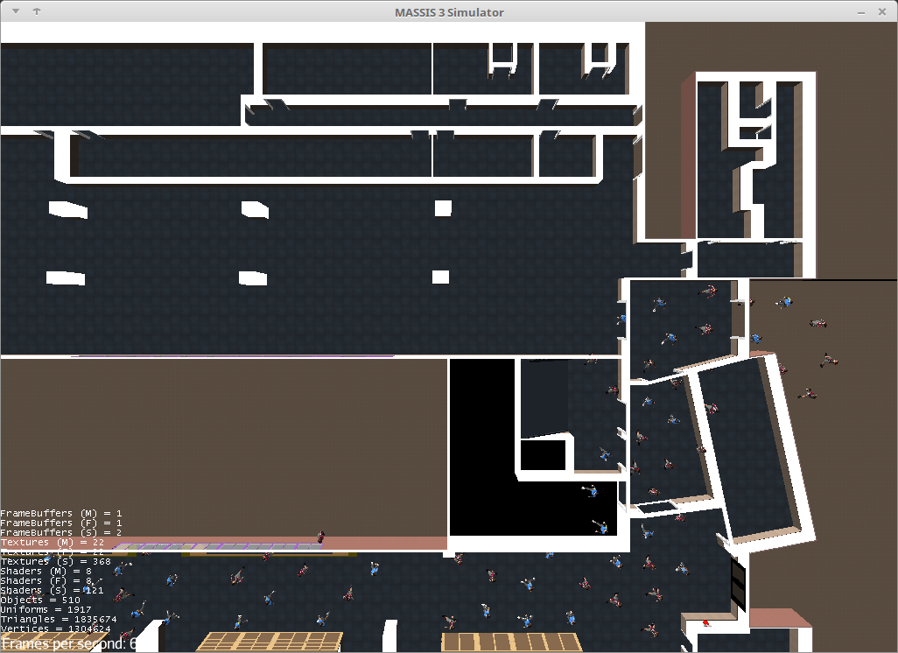

# Getting started

[back to main](index.md)

MASSIS has been created using [Maven](https://maven.apache.org/) and [Java 8](http://www.oracle.com/technetwork/java/javase/overview/java8-2100321.html). Therefore, a prerrequisite for using MASSIS is to have installed the [Java 8 SDK](http://www.oracle.com/technetwork/java/javase/downloads/jdk8-downloads-2133151.html) and the last version of [Maven](https://maven.apache.org/) (Currently working with Apache Maven 3.3.9).

Maven can be installed from here: [https://maven.apache.org/install.html](https://maven.apache.org/install.html)

The tool has an installation assistant for the examples, which is written in Python. To check whether Python is installed, use the following command:

```bash
> python3 --version
Python 3.5.2

```
If Python is not installed in your Linux system, you can do it with the following commands:

```bash
> sudo apt-get update
> sudo apt-get install -y python3
```

In its current version, MASSIS also uses the [JMonkeyEngine](http://jmonkeyengine.org/) to show the simulation in 3D. The JMonkeyEngine will be installed in the system by Maven, but it requires  the [OpenGL](https://www.opengl.org/) hardware acceleration to be enabled on the system. The following command (in Linux) checks whether OpenGL is installed on the system:


```bash
> sudo apt-get install mesa-utils

> glxinfo | grep "direct rendering"
direct rendering: Yes

```

It is advisable to have installed the [Ogg](https://xiph.org/ogg/) libraries on the system. Its absence does not prevent execution but generates several warning logs.

## Installation

To install Massis,  clone the following repositories (one for the Massis core, and another for the assets, i.e., animations, models and scenes):

```bash
> git clone asset repository
> git clone core repository
```
Then for the tutorial you will need the following:

```bash
> git clone https://github.com/ismaelucm/massis_tutorial.git
```

Move into *massis3-4* directory and  compile the project using Maven:

```bash
> cd massis3-4
> mvn compile
> mvn install
```

Next, change to the directory *massis3-examples* and  compile de example project using the Python script `install.py`:

```bash
> cd massis3-examples
> python3 install.py
```
This installation requires to provide some data for configuration of the server for the simulations:
* host_ip=127.0.0.1
* host_port=8080  (or other not in use)
* host_path=/home/xxx/xxx/massis3-assets/  (the directory where the massis3-assets where extracted from the zip file)

## Test installation with first execution

Now Massis  is installed in the system and the tutorial is ready. To check that everything is working properly, being in the *massis3-examples* directory, try to  launch one simulation:


```bash
> cd massis3-examples
> chmod 755 LaunchServer.sh
> ./LaunchServer.sh
```

The first execution takes quite a long time (several minutes) to start because the system has to create the navigation meshes and other assets, and this requires  a considerable number of calculations. Be patient and wait until the process is finished, this will be only once.
Note that during this first execution, a window appears and only after the system has built all the necessary elements, the animation of the simulation will be displayed. This first example shows some people entering in the building and going to some classrooms. Once they are in the classrooms, they stay there. You can stop the simulation with ctrl-C in the terminal window.




## Camera controlling

There are some simple commands to move in the animation window:
* Q and Z to zoom-in and zoom-out (this can be done also with mouse scrolling).
* A and D to move to the left and to the right.
* W and S to move up and down respectively.

Try again to launch the simulation and check that this time it does not take too much time to start.

[Back to main](index.md)
[Next](Examples.md)
